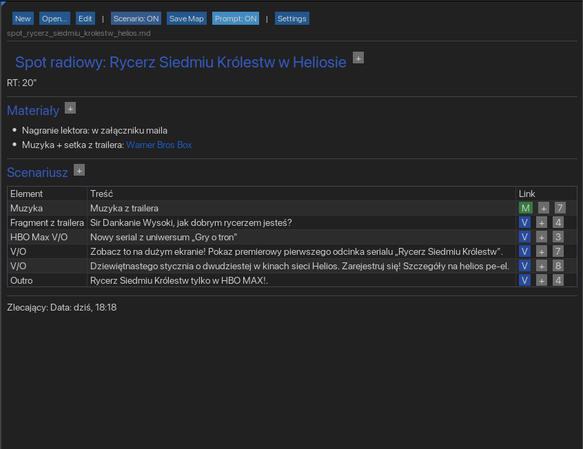
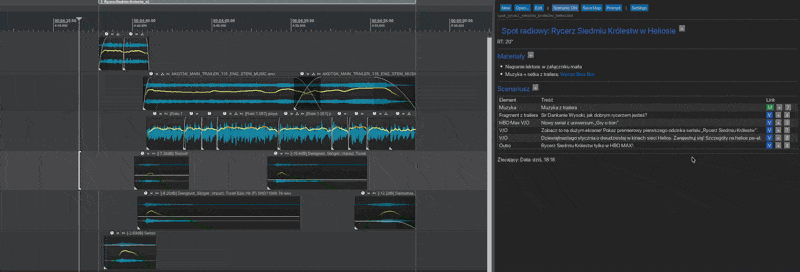
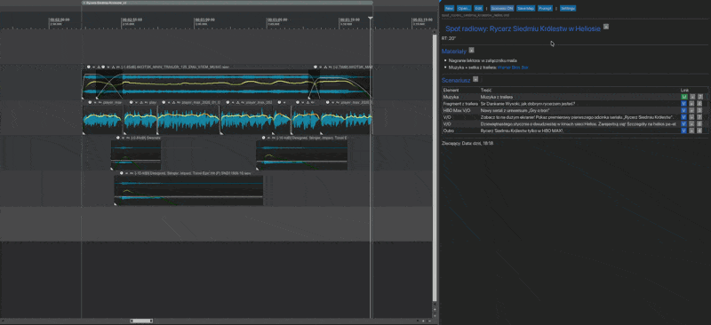
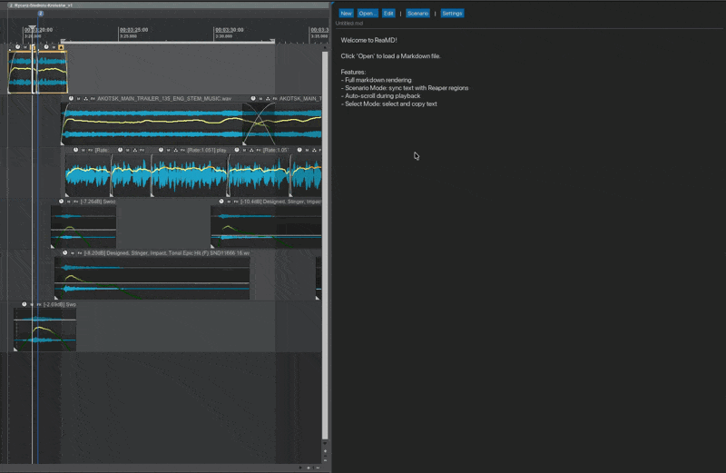
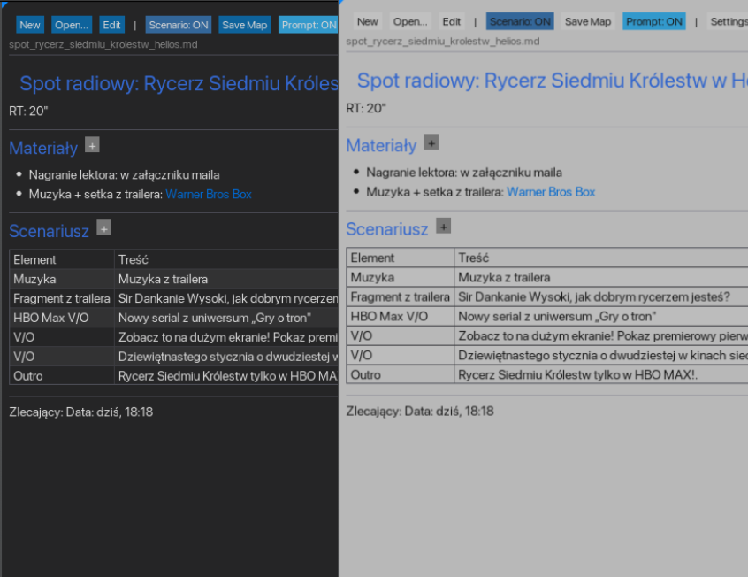
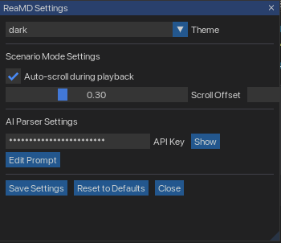
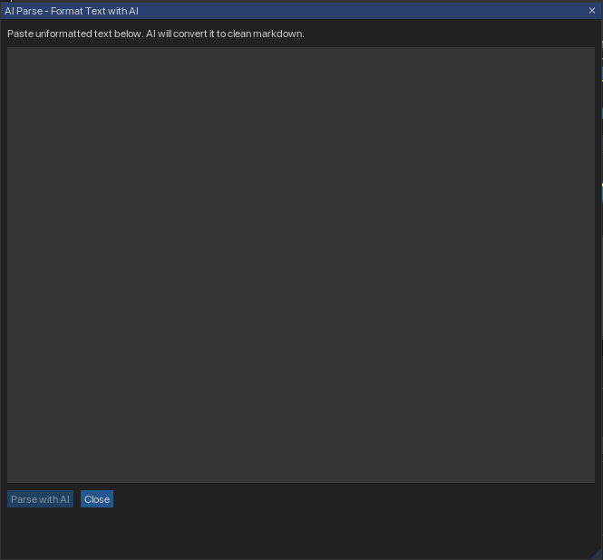

<p align="center">
  
</p>

<h1 align="center">ReaMD</h1>

<p align="center">
  <strong>Dockable Markdown Viewer for REAPER DAW</strong><br>
  Scenario linking, teleprompter mode, and AI-powered text formatting
</p>

<p align="center">
  <a href="#features">Features</a> •
  <a href="#installation">Installation</a> •
  <a href="#usage">Usage</a> •
  <a href="#ai-parse">AI Parse</a> •
  <a href="#screenshots">Screenshots</a> •
  <a href="#license">License</a>
</p>

<p align="center">
  
  
  
  
  
</p>

---

## What is ReaMD?

ReaMD is a **dockable markdown viewer** designed specifically for audio production workflows in REAPER. It bridges the gap between your scripts, notes, and the timeline - allowing you to link text fragments directly to items on your tracks.

Perfect for:
- **Voiceover production** - Link script lines to VO recordings
- **Audio post-production** - Sync scene descriptions with sound design
- **Podcast editing** - Follow show notes while editing
- **Music production** - Keep lyrics and arrangement notes in view

---

## Features

### Core Markdown Support
- Full markdown rendering (headers, lists, tables, code blocks, blockquotes)
- **Edit mode** - Write and modify markdown directly in REAPER
- **Dark & Light themes** - Seamlessly match your REAPER theme
- Dockable window - Integrate into your workflow

### Scenario Linking
- **Link text fragments to timeline items** - Click a paragraph, jump to the item
- **Multi-item support** - One fragment can reference multiple items
- **Category colors** - V (Voiceover), M (Music), F (FX), O (Other)
- **Group awareness** - REAPER item groups treated as single units
- **Visual feedback** - Linked fragments highlighted, playback position tracked

### Teleprompter Mode
- **VO-focused display** - Shows only voiceover text, large and centered
- **Auto-scroll** - Follows playback position automatically
- **Progress indicator** - Orange (next cue) / Green (current item ending)
- **Semi-transparent overlay** - 50% opacity, stays out of the way

### AI Parse (Claude Integration)
- **Paste unformatted text** - Meeting notes, raw scripts, brain dumps
- **AI formats to markdown** - Clean structure with proper headings and lists
- **Customizable prompt** - Tailor the AI behavior to your workflow
- **Non-blocking** - Async processing, UI stays responsive

---

## Installation

### Requirements

| Component | Version | Required |
|-----------|---------|----------|
| REAPER | 7.0+ | Yes |
| ReaImGui | 0.10+ | Yes |
| js_ReaScriptAPI | Latest | Recommended |
| SWS Extension | Latest | Recommended |

### Quick Install

1. **Install ReaImGui** (if not already installed):
   - Open REAPER → Extensions → ReaPack → Browse packages
   - Search for "ReaImGui" → Install

2. **Download ReaMD**:
   - Download the [latest release](https://github.com/b451c/ReaMD/releases/latest)
   - Or clone: `git clone https://github.com/b451c/ReaMD.git`

3. **Copy to REAPER Scripts folder**:
   ```
   Windows: %APPDATA%\REAPER\Scripts\ReaMD\
   macOS:   ~/Library/Application Support/REAPER/Scripts/ReaMD/
   Linux:   ~/.config/REAPER/Scripts/ReaMD/
   ```

4. **Load the script**:
   - REAPER → Actions → Load ReaScript
   - Select `Main/ReaMD.lua`
   - Assign to toolbar or shortcut

> **Tip:** For full functionality, also install [js_ReaScriptAPI](https://forum.cockos.com/showthread.php?t=212174) and [SWS Extension](https://www.sws-extension.org/).

---

## Usage

### Basic Workflow

1. **Open a markdown file** - Click "Open..." or drag & drop
2. **Dock the window** - Right-click title bar → Dock
3. **Browse your script** - Scroll, search, navigate headings

### Scenario Linking

1. **Enter Scenario Mode** - Toggle "Scenario" in toolbar
2. **Select items on timeline** - The items you want to link
3. **Click [+] on a text fragment** - Links selected items to that text
4. **Click linked text** - Jumps to and selects the items
5. **Play** - Text highlights follow playback position

<p align="center">
  
</p>

### Teleprompter

1. **Set up scenario links** - At least link your VO items
2. **Click "Teleprompter"** - Opens focused display window
3. **Start playback** - Text auto-scrolls with timeline

<p align="center">
  
</p>

---

## AI Parse

Transform unstructured text into clean markdown using Claude AI.

### Setup

1. Get an API key from [Anthropic Console](https://console.anthropic.com/)
2. In ReaMD, open **Settings** (gear icon)
3. Paste your API key in the "AI Parser Settings" section

### Usage

1. Click **New → AI Parse...**
2. Paste your unformatted text
3. Click **Parse with AI**
4. Review the result → **Save As...**

### Customize the Prompt

Click **Edit Prompt** in settings to modify `prompts/ai_format_prompt.txt`. Tailor it for your specific use case (voiceover scripts, technical docs, meeting notes, etc.).

<p align="center">
  
</p>

> **Note:** AI Parse requires an internet connection and uses the Claude Haiku model for fast, cost-effective processing.

---

## Screenshots

<details>
<summary><strong>Dark & Light Themes</strong></summary>
<p align="center">
  
</p>
</details>

<details>
<summary><strong>Settings Panel</strong></summary>
<p align="center">
  
</p>
</details>

<details>
<summary><strong>AI Parse Window</strong></summary>
<p align="center">
  
</p>
</details>

---

## File Structure

```
ReaMD/
├── Main/
│   └── ReaMD.lua           # Main script (run this)
├── Libs/
│   ├── ai_parser.lua       # AI integration module
│   ├── config.lua          # Settings management
│   ├── json.lua            # JSON encoder/decoder
│   ├── md_parser.lua       # Markdown parser
│   ├── md_renderer.lua     # ReaImGui renderer
│   ├── scenario_engine.lua # Timeline linking engine
│   ├── teleprompter.lua    # Teleprompter mode
│   └── utils.lua           # Utility functions
└── prompts/
    └── ai_format_prompt.txt # Customizable AI prompt
```

---

## Troubleshooting

### "ReaImGui not found"
Install ReaImGui via ReaPack: Extensions → ReaPack → Browse packages → Search "ReaImGui"

### AI Parse not working
- Verify your API key is correct in Settings
- Check internet connection
- On Windows, ensure `curl` is available (comes with Windows 10+)

### Teleprompter not following playback
- Ensure scenario links are set up (fragments linked to timeline items)
- Check that linked items exist on the timeline

---

## Contributing

Contributions are welcome! Please feel free to submit issues and pull requests.

1. Fork the repository
2. Create your feature branch (`git checkout -b feature/amazing-feature`)
3. Commit your changes (`git commit -m 'Add amazing feature'`)
4. Push to the branch (`git push origin feature/amazing-feature`)
5. Open a Pull Request

---

## License

This project is licensed under the MIT License - see the [LICENSE](LICENSE) file for details.

---

## Acknowledgments

- [ReaImGui](https://github.com/cfillion/reaimgui) by cfillion - Amazing ImGui bindings for REAPER
- [REAPER](https://www.reaper.fm/) by Cockos - The best DAW for scripting
- [Anthropic](https://www.anthropic.com/) - Claude AI for text formatting

---

<p align="center">
  Made with ❤️ for the REAPER community
</p>
